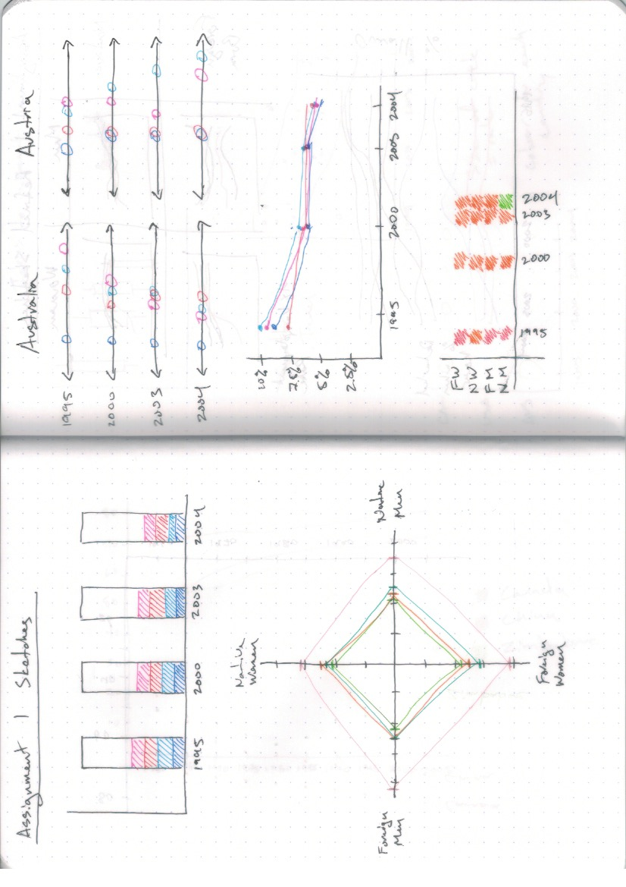
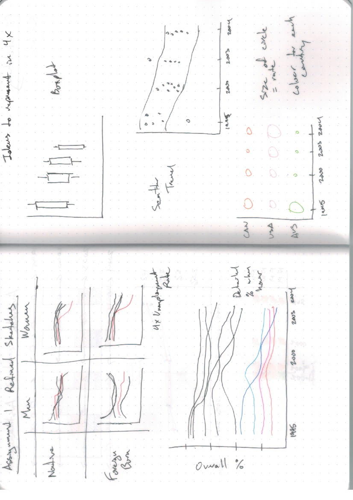
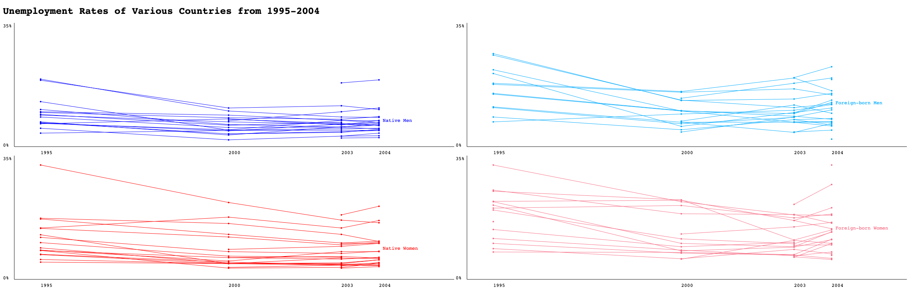

CPSC 583 - W2021

Jordan Lee (30002218)

# Assignment 1

## Understand the Data

1. The data includes unemployment rates as a percentage of the total labour force in various countries over the years of 1995-2004, separated into 4 categories: native men, foreign-born men, native women, and foreign-born women. 
   - **Country** is a dimension and nominal variable, since there is no intrinsic ordering. 

   - **Year** is a dimension and a quantitative-interval variable, since there is an order and an arbitrary zero. Measurement is not useful, but the intervals between them are.

   - **Native/Foreign-born Men/Women** is a dimension and nominal variable, because they are categories and one category cannot be ranked above or below another.

   - **Unemployment rate** is a measure and a quantitative-ratio variable, as it is a percentage. There is a meaningful origin (0%) and it represents an amount.
2. There are missing data points throughout the table, which may pose a challenge when representing the entire dataset. As well, the intervals between the years are not the same. The range is from 1995-2004, but years 1996-1999 and 2001-2002 are not present. There is also a large amount of countries, so if everything is overlaid in the visualization it could be difficult to distinguish between certain information.

## Manipulate and Visualize the Data

3. Sketches

4. Visualize

## Reflect on Your Visualization

5. I chose to use position to represent the dataset information, in the form of line charts. Unemployment rate is a quantitative variable, and position is ranked first for quantitative data in Mackinlay's ranking of encodings. In my visualization, the mark's location on the y-axis represents the percentage of unemployment, which is expressive (the data is presented, and only the data) and effective (different values can be easily distinguished). The location on the x-axis shows the year, which is also a quantitative variable and follows the same design decisions as the percentage of unemployment. As well, the lines' orientation can easily show trends between years and countries. 

   The nominal data of Native/Foreign-born Men/Women is effectively represented by colour hue, which indicates that different data is being shown between the line charts. Colour hue is ranked highly by Mackinlay for nominal data, but lowly for quantitative data. This is appropriate, as the selective/associative properties are used to differentiate the categories while the non-ordered property prevents an ordering from being applied to them.

6. The line charts do not have labels for the axes since they can be easily inferred from the chart title, and include only the most important scale labels; minimum/maximum percentage values, and years (as the interval between data points are not the same). There are no graphics to minimize chart junk and to focus on the data. "Small multiples" was chosen over layering the charts because each line represents a single country, and would be too dense if all data was shown on one chart. 

7. My visualization shows four line charts for the four categories of native/foreign-born men/women, and how they trend overall over time. The category label is placed at the right side of the data, at the height of the average unemployment rate in 2004 of that category which provide an unrelated but interesting metric. However, the countries cannot be distinguished using the visualization, but the outliers can be cross-referenced with the dataset file to determine which country it is. Given more time, I would introduce functionality where by hovering over a datapoint would highlight it and display the value and country name, as well as highlight data corresponding to that country in other charts.

   Overall, most countries indicated a downward trend in unemployment for all categories. Outliers include: 

   - Spain in the Native Women category; although it has a similar trend to the other countries, the 1995 rate of unemployment is noticeably higher than the rest of the data. 
   - Another is Slovak Republic in the Native Men and Native Women charts, where the unemployment rate is relatively high and increases over time. There is only data between 2003-2004 for this country.
   - Finland and Germany shows a similar pattern in the Foreign-born Men chart, as they trend upwards while most others decrease. Also in this chart, Hungary only has one data point (2004) and it is particularly low. Slovak Republic also only has one data point (2004), and is relatively high. Notably, this is the only chart that seems to have an inflection point in the overall trend: many countries increase in unemployment of Foreign-born Men between 2000-2003 before continuing to decrease.
   - As for the Foreign-born Women category, Finland and Germany again go against the grain and have an upwards trend over time compared to the downward trend of the other countries, and Slovak Republic's (only) data point for 2004 has an exceptionally high rate of unemployment - the highest of the entire dataset.

   The same few countries seem to consistently behave differently compared to the rest, namely Slovak Republic, which has the least data of all countries. Along with the Slovak Republic, Germany does not follow the overall trend of decreasing unemployment. Further analysis may provide insight to why this is the case (eg. political events, economy, etc.).

