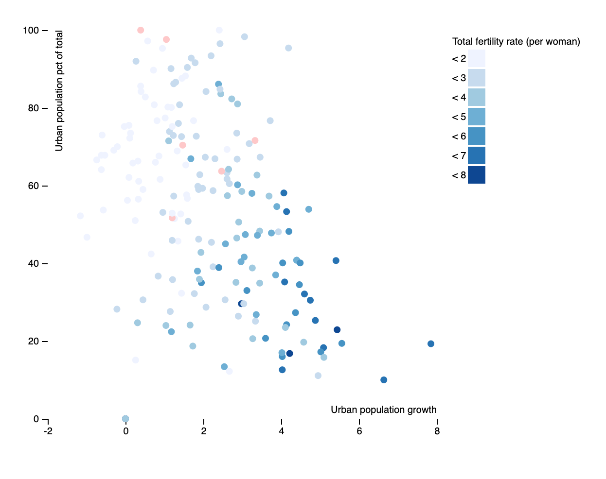

CPSC 583 - W2021

Jordan Lee (30002218)

# Assignment 2

5. Meaningful visually distinct change: Maximize the data to ink ratio by removing the axis lines and reducing number of ticks and tick labels
6. Resulting visualization by changing D3 code:

## Reflection

7. Overall, the resulting visualization closely resembles what I aimed for. One thing I was not able to accomplish was to reduce the number of tick labels, so that only every other tick would have a label. Since this is a simple linear scale, the value ticks without labels could still be easily interpreted. This result is still effective in presenting the data and the data to ink ratio is improved.
8. Although this visualization change was accomplished through modifying the D3 library, doing it without changing the library would be better. When creating an axis, one would expect that the line would be included. It would be best if there was an option to remove the line from the axis when creating it, so that the default functionality produces what is expected, while there is flexibility of producing a minimal axis that only has the ticks. In fact, this is how the D3 library accomplishes this, and using this method the original behaviour can be maintained.