CPSC 583 - W2021

Jordan Lee (30002218)

# P2 - Sketching

## Sketchable Data Subsets

### Subset 1: Stage Number, Distance, and Date

The focus for subset 1 was to show how stage distances of the Tour de France changed over time. This subset contains over 2000 rows and 3 columns, and every year of the Tour in this dataset has data in this subset. Because not every year of the Tour has the same number of stages (especially the earlier years), there is "missing data". The varying number of stages, as well as the changing distance covered by each stage, can provide insight to the difficulty of this sporting event and how it has changed over the years.

However, this subset is still too large to sketch in its entirety, so sketches were based on a smaller subset. Certain sketches showed data for a few years at a time, or a limited selection of stages. I also explored the idea of visualizing a single year, and comparing it to the rest of the data through averages, minimum/maximum values, etc.

### Subset 2: Origin/Destination City, and Date

Subset 2 included the host cities that were involved in various Tours, and contains data for every single tour (recorded in this dataset). Although date is included, there is less emphasis on how they change over time and more on the year that they were involved. Being a host city can bring prestige and an economic boom to the area, and visualizations of this subset can be helpful for further analysis.

This subset was of similar size to Subset 1, but due to the categorical nature of the data I found it easier to include the entire subset in my sketches. Some sketches visualized only one year in comparison to the data, and some sketches did not include date at all and focused on the frequency of popular cities included in the Tour. 

## Design Direction

The refined sketches reflected the more common and intuitive ways to represent the data. For example, distances over time are commonly expressed as line or bar charts, and cities are intuitively visualized on a map. There were novel ideas introduced in the initial sketches, but the traditional visualizations proved to be more effective and expressive, and were more likely to be chosen to be developed further.

Not all sketches (both initial and refined) visualize the same information for the same dataset. For instance, one sketch for Subset 2 represents the overall number of times that a city hosted a stage of the Tour de France, but another sketch for the same subset shows the specific year that the city was an origin or destination city. As expected, the frequency visualizations were generally more compact and more easily represented the entire subset of data compared to the specific year-to-year visualization, which only included a few years in the sketch. Even though some of the visualizations with a limited scope are effective, when they are scaled to include the entire subset it can be overwhelming to comprehend because of the large amount of small multiples.

 

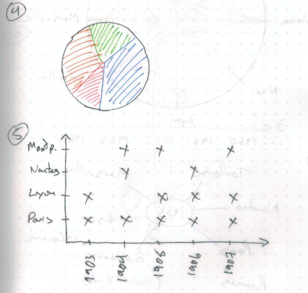

## Process and Results

The two subsets were created with a clear goal in mind, which drove the results of the sketches. I approached the visualizations first with immediate ideas on how the information could be represented intuitively. Next, I explored ideas that were commonly used to show similar data. Finally, if I did not have ten sketches yet, I would try visualizations that were not traditionally used if they could represent the data.

Since some of the sketches were based on a subset of the subset, ideas that could not scale to represent the entire dataset were not explored further. To refine the sketches, I would modify ideas from the initial sketches by changing the type of encoding, or apply the same visualization to a different subset. 

Experimenting with colour made it apparent that there were not enough distinguishable colours to represent the big range of variables. As an example, there are at most 21 stages but there are less than 21 variations of colour that can be easily distinguished.  Rather than assigning a colour to every single value, I used colour to highlight certain information from the rest or to represent a range of values.

 

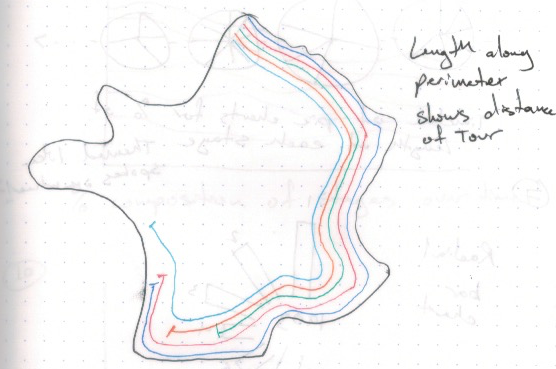

 

As well, the visualizations focused only on the subset and may not work as well if the subset was expanded to include other variables. The refined sketches have ideas that are specialized to represent that information, and introducing another column to the subset is difficult.

## Conclusion

From the sketches done, showing stage numbers and distances over years is likely best with a line or bar chart. Representing the large amount of data all at once in an easily comparable and comprehensible manner is a challenging task, and this traditional visualization is a compact way of accomplishing it. For Subset 2, cities are commonly shown on a map, and by leveraging this familiarity an effective visualization can be created. 

On the other hand, non-traditional visualizations are not without their strengths. I found that the circle representation for refined Subset 2 sketches was particularly effective, in that it was able to show both overall data as well as a specific year's information at the same time. Furthermore, it can be easily adapted to include even more information, such as the order in which cities are visited of a given year's Tour de France.

 

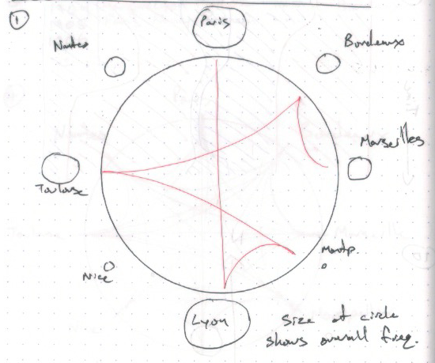

## Appendix

### Sketches (All)

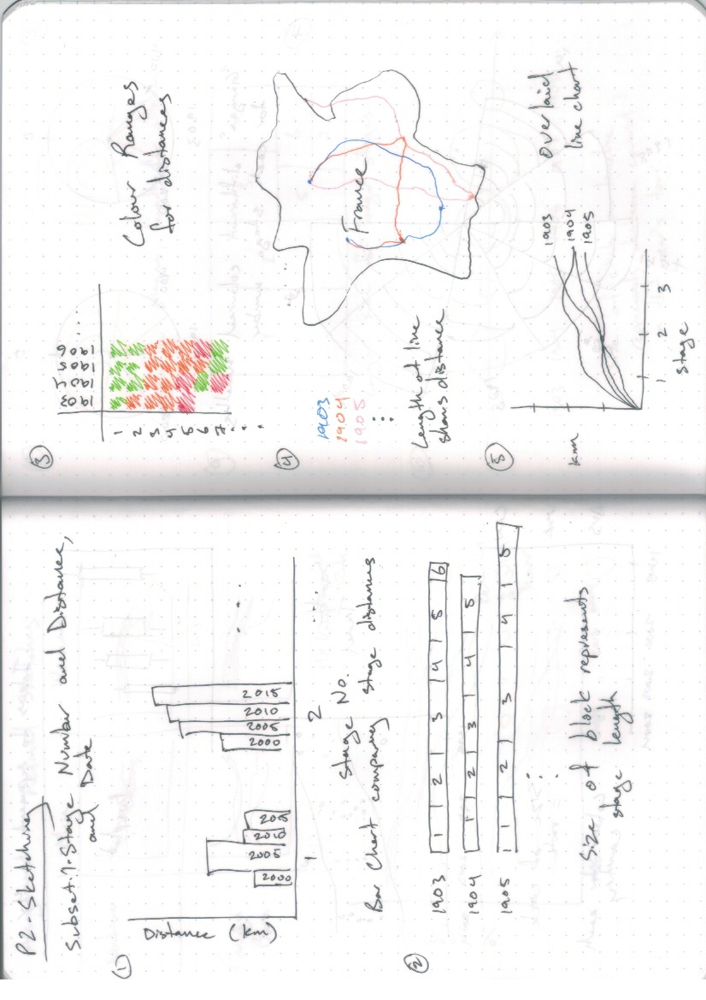

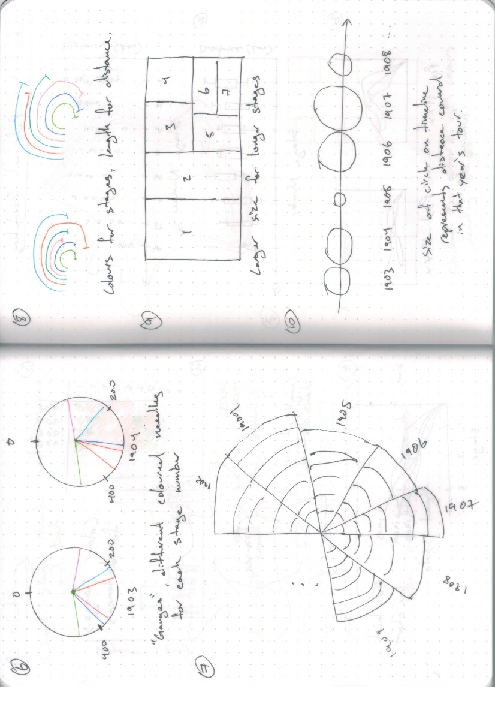

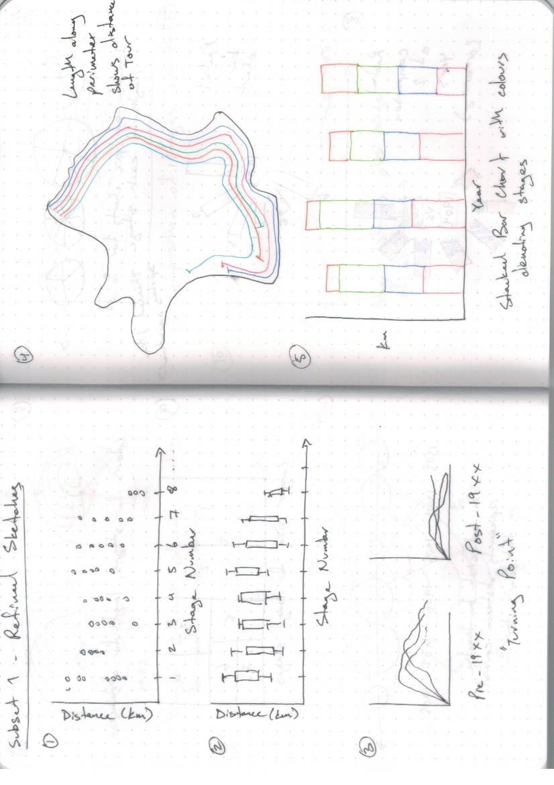

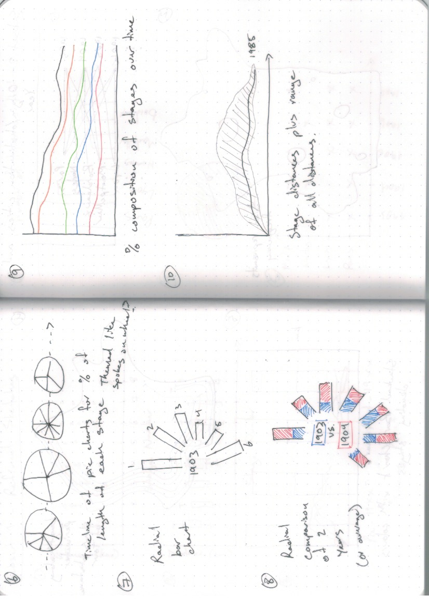

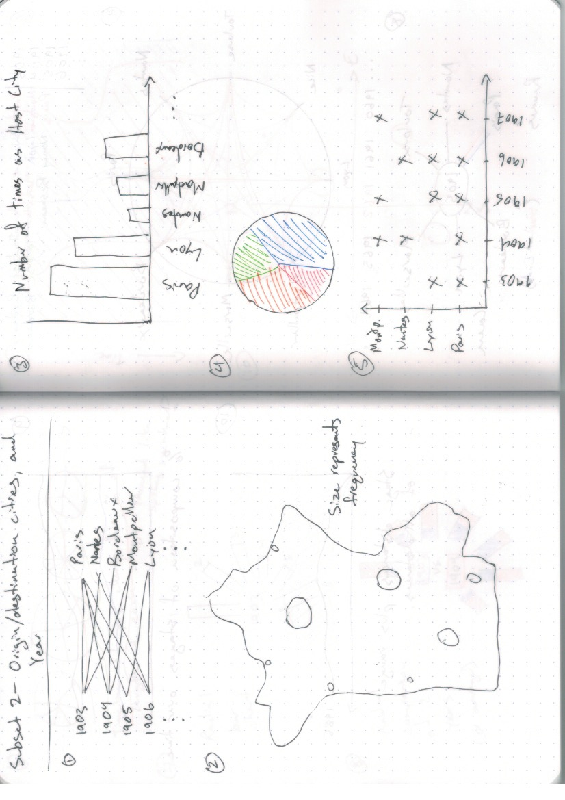

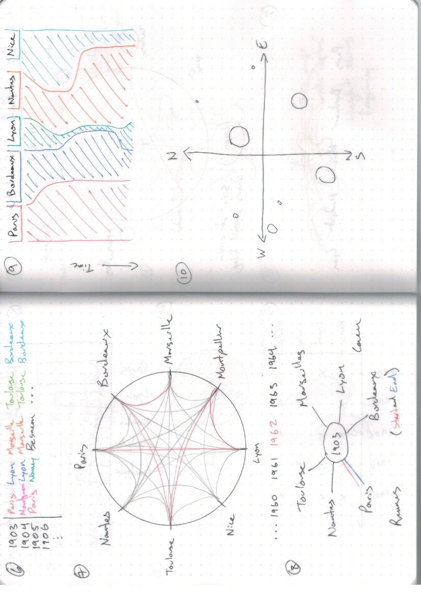

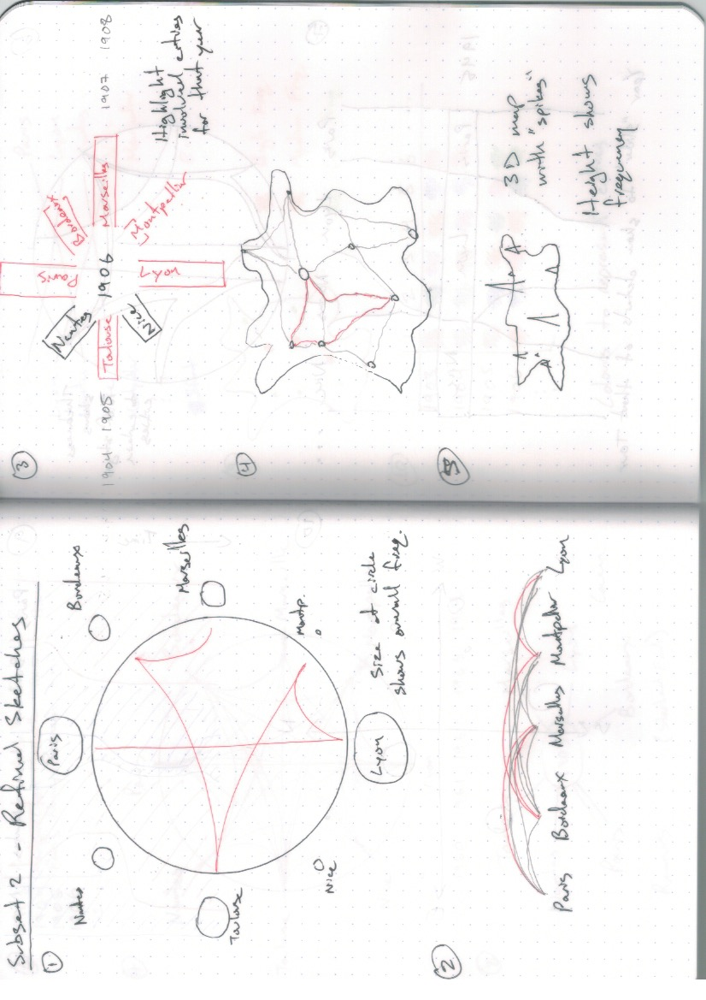

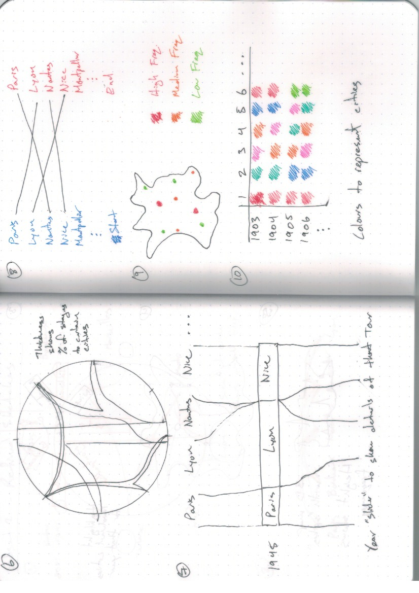

### Buddy Contract